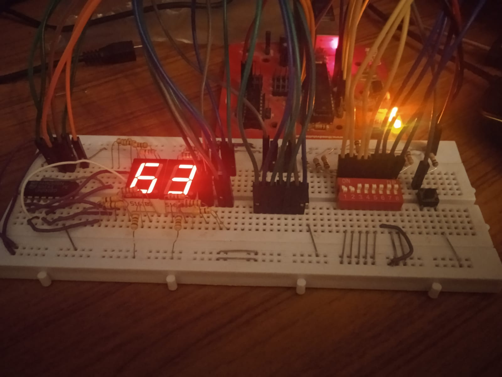

# hexagon
An electronic hexadecimal and decimal display!

Control a 2 digit seven segment display using an 8 position DIP switch.
You can switch between a decimal display and a hexadecimal display using
the toggle button.

### How does it work?
Input is taken from each of the 'bits' in the DIP switch as binary. This is then converted into decimal and hexadecimal representations respectively. Depending on the state of the button it displays one or the other. Data is fed in to each display using a shift register. The two registers are daisy chained, meaning that they only use 3 pins on the arduino. I didn't have a 74HC165 Pararell to Serial Shift Register, or I would have converted the DIP switch input to use that as well, reducing my total pins to around 6, versus the current 13.
  
The code doesn't use anything besides the arduino's standard library, for learning purposes. The code is also terribly written because I don't know C++. One problem that is still present is that since I only had 2 seven segment displays on hand, the decimal mode only works upto 99, and after that the third digit isn't displayed.

### What I Made

### Schematic

